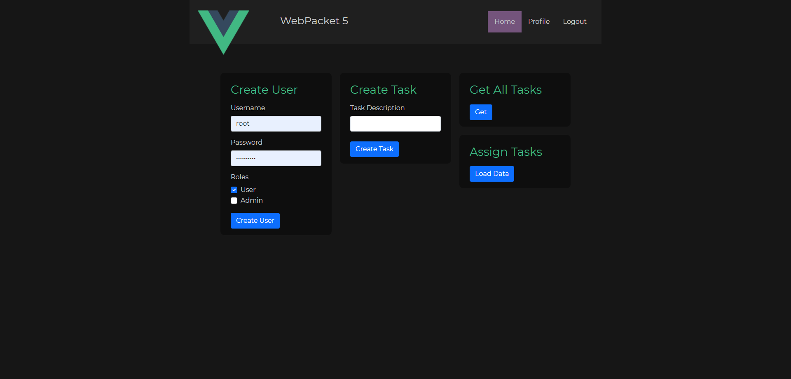
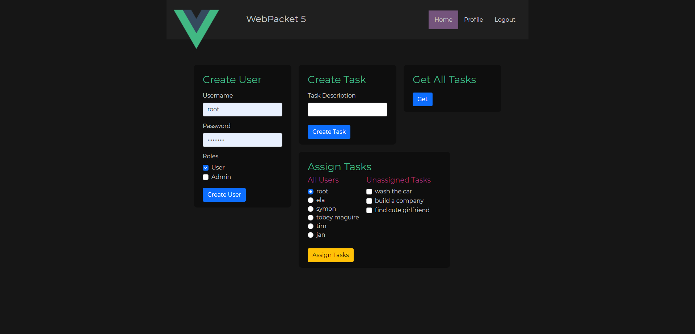
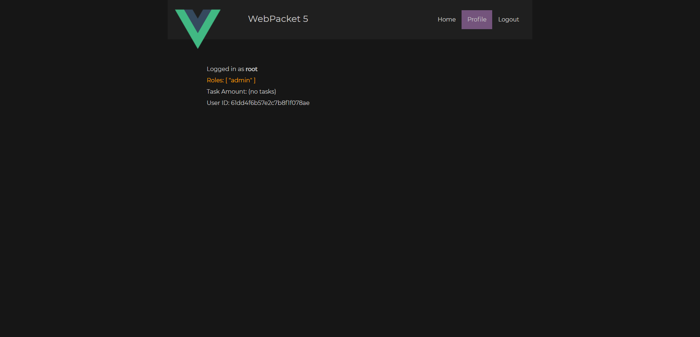
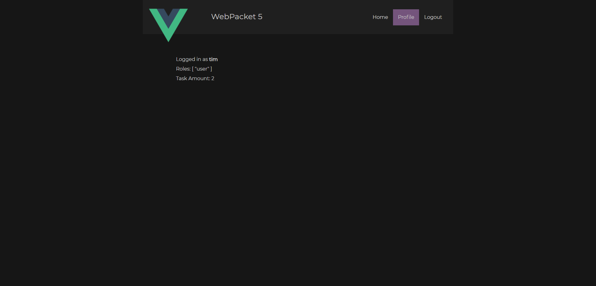

  
  
  
    
   

## Prerequisite
- [Node.js](https://nodejs.org/en/)
- [MongoDB](https://www.mongodb.com/try/download/community)

## Serve

### A. Frontend ([VueJS](https://vuejs.org/))
#### Option 1: Serve using Vue CLI

One line: `npm install && npm install -g @vue/cli && vue upgrade && npx vue-cli-service serve`, or:

1. Install dependencies `npm install`
2. Install Vue CLI `npm install -g @vue/cli`
3. Upgrade Vue plugins to latest version `vue upgrade`
4. Actually serve the app `npx vue-cli-service serve`
5. Navigate to the printed link

#### Option 2: Serve using Vue UI
1. Install dependencies `npm install`
2. Install Vue CLI `npm install -g @vue/cli`
3. Upgrade Vue plugins to latest version `vue upgrade`
4. Open Vue UI `vue ui`
5. Click 'Import' at the top-right corner
6. Navigate to project root
7. Hit 'Import this folder'
8. Left navigation > Tasks > serve
9. Click on 'Run task'
10. Wait for project compilation
11. Hit 'Open app'

### B. Backend ([ExpressJS](https://expressjs.com/))

One line: `npm install && node seed.js && node app.js`, or:

1. Install dependencies `npm install`
2. Seed MongoDB with sample data `node seed.js`
3. Serve `node app.js`

## Demo Screenshots

### Login

### As Root: Home

### As Root: Get All Tasks Component

### As Root: Assign Tasks Component

### Root Profile

### User Profile

